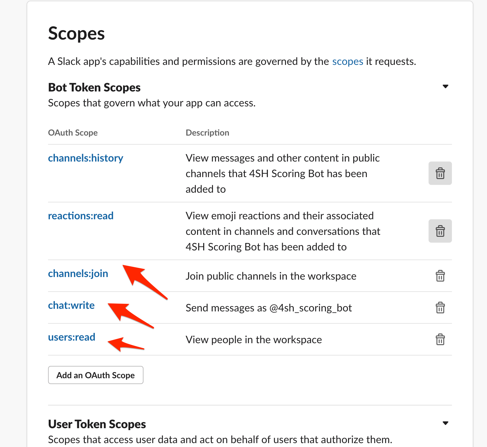

# <h1 align="center">Welcome to Slack GAS Scoring Bot 👋</h1>
> A Google App Script-based Scoring bot to manage channel-based quizz / scores in Slack

## Overview

During lockdown, we all have more Slack interactions than usual, and sometimes, it's nice to relax by
playing with your colleagues on some quizz (it generally helps to know them better).

This bot is aimed at managing some threaded questions (1 question = 1 thread) where thread author can
ask any question, and can judge of the provided responses with reactions.
People providing answers and receiving reactions from thread author will earn points (you can associate
different earning depending on the reaction).

Example : goal of this channel is to guess things based on emojis

Some sample quizz channel I setup at 4SH using this bot :
- `guess-the-picture` : Each user can post 1 picture per day extracted from his daily routine (home, garden, whatever)
  and is shared on the channel. Others have to guess what this picture represents.
- `guess-the-emojis` : Each user can post a list of emojis + a hashtag hint (ex: #movie, #tvshow, #book, #band, #game)
  Others have to guess what this list of emojis mean. Simply use your imagination, unlimited possibilities.

## Installation instructions

### Installation pre-requisites

- `npm@3+`
- A Google account
- Being administrator of your Slack channel (or knowing the admin as you will have to register the bot on it)
- This repository being cloned somewhere on your filesystem 

### Slack Bot Deployment

- Move to the `scoring-slack-bot/` directory then run `npm install` on it
- Authenticate with `clasp` (google app script CLI) with `npx clasp login` (follow instructions)  
  Note: `clasp` is a CLI to manage your Google App Scripts, and it's powered by Google (more infos [here](https://codelabs.developers.google.com/codelabs/clasp/))
- Enable app script API here : https://script.google.com/home/usersettings
- Run `npx clasp create --type api` : a new google app script should be created under your google account.
- Run `npx clasp push` (or `npx clasp push --watch` if you want to edit/auto-deploy some changes made to the script)
  - `Manifest file has been updated. Do you want to push and overwrite?` => Answer "Yes" here
    Files are going to be compiled and pushed into your Google App Script.
- Run `npx clasp deploy` : a new version of your API is going to be made available on the internet
- Open your app script by running `npx clasp open`
  - Once opened, click on the "play" button in order to try to execute doPost function
  - By executing this, you should have an `Authorization required` popup : examine and grant authorizations to your current google account
    Note that if you get a "This application has not been validated (yet) by Google" error, click on `Advanced parameters`
    and proceed to the page (unsecure content)
  - There may have some errors executing doPost : don't worry that's expected (purpose was only to grant authorization to your user)
  - Open the `Publish > Deploy as web app` menu
  - In the popup, copy `Current Web app` URL : this is going to be your HTTP entrypoint for the Bot  
    ⚠️ Avoid sharing this URL too widely, as anyone having access to this URL will be able to control the Bot and cheat :-)
  - Open `File > Project Properties` and select the `Script Properties` tab then create following properties / values :

  | Property name | Value | Meaning |
  |---------------|-------|---------|
  | LOG_ENABLED | true | This can be helpful to see logs, particularly at the beginning |
  | SLACK_CHALLENGE_ACTIVATED | true | Put this to true in order to allow Slack bot challenge |

### Slack instance configuration

- As a Slack administrator, open your Slack App page [here](https://api.slack.com/apps)
- Click on `Create New App` button to create a new Application
  
- Fill App Creation popup and reference the Slack Workspace
  
- Once done, and from `Basic Information` screen, open the `Event subscriptions` configuration page
  
- Activate events and paster Google App Script's Slack Bot URL you copied previously :
  
  - Wait for Google App Script challenge verification : if there is a failure, review Google App Script's `SLACK_CHALLENGE_ACTIVATED` project property
   to ensure this is valued to `true` and verify that GAS execution authorization has been granted.
  - Declare 3 `bot events` described in screenshot above : `message.channels`, `reaction_added` et `reaction_removed`
  - Don't forget to save changes
- Once done, navigate to `OAuth & Permissions` section  
  
  - In `Scopes` section, there should already be `channels:history` & `reactions:read` ; Add `channels:join`, `chat:write` and `users:read`
    
  - Once done, click on `Install App to Workspace` button on top of the screen, and validate permissions configured previously
    
  - Copy generated `Bot User OAuth Access Token` ...
    
  - ... and paste it into Google App Script's `SLACK_ACCESS_TOKEN` Project Properties. At the same time, disable `SLACK_CHALLENGE_ACTIVATED` flag.
    

### Scores Spreadsheet config & DB creation

- Move to the `slack-scores-sheet/` directory then run `npm install` on it
- Run `npx clasp create --type sheets` : a new google spreadsheet & app script should be created under your google account.
  - Copy generated google spreadsheet id ...
    
  - ... and paste it into the GAS `SPREADSHEET_ID` project property
    
  - Open Google spreadsheet based on the created URL : this will be useful in next steps as we're going to fill this spreadsheet
    with some data.
- Run `npx clasp push` (or `npx clasp push --watch` if you want to edit/auto-deploy some changes made to the script)
  - `Manifest file has been updated. Do you want to push and overwrite?` => Answer "Yes" here
    Files are going to be compiled and pushed into your Google App Script.

### Slack channel configuration

- Open Slack and invite the bot into one of your channels (prefer to choose a testing channel to begin with) : `/invite @<bot_name>`
- Initialize the channel by saying `!setup <a config name>` (use any string, like `testing` for the config name)
- This command should create a lot of tabs in the Google Spreadsheet (`Logs`, `UserList`, `Config`, `<config name>`, `<config name>-ReactionsLog`)
- You can configure your channel preferences on the `Config` tab, on the `ChannelConfig` cell which is a JSON :
  - `adminUser`: User id of the channel id, can be omitted.
  - `restrictReactionsToThreadAuthors`: Only thread authors are allowed to put reactions on threads that gives points
  - `reactionsConfigs`: Put here the different reactions that are going to generate points (and how many points it will represent)
- Channel help can be displayed by saying `!help`
- In the spreadsheet, run `File > Publish on web` and :
  - Select `<config name>` tab and click on `Publish`
  - Copy URL corresponding to the `<config name>` tab (this will contain your channel's leaderboard scores)
  - Paste this URL in the `Config` tab's `Leaderboard` column : this link will be used when `!scores` will be run in the channel
